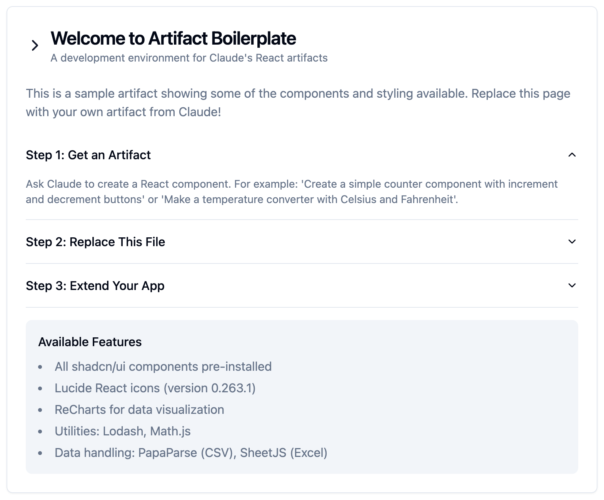

# Artifact Boilerplate

A development environment for building with Claude's React artifacts. This template includes everything you need to run and extend artifacts into full applications.



## Features

- 🎨 All shadcn/ui components pre-installed
- 📊 Data visualization with ReCharts
- 🛠️ Utility libraries (Lodash, Math.js)
- 📝 Data processing (PapaParse for CSV, SheetJS for Excel)
- 🎭 Icons from Lucide React (v0.263.1)
- 🎯 TypeScript & ESLint configuration
- 🎨 Tailwind CSS with proper configuration

## Quick Start

```bash
# Clone the repository
git clone https://github.com/o-stahl/artifact-boilerplate.git
cd artifact-boilerplate

# Install dependencies
npm install

# Start the development server
npm run dev
```

Visit `http://localhost:3000` to see the welcome page.

## Using with Claude Artifacts

1. Get a React artifact from Claude (example prompts):
   - "Create a counter component with increment/decrement buttons"
   - "Make a temperature converter with Celsius and Fahrenheit"
   - "Build a todo list with local storage"

2. Copy the entire artifact code (including imports) and replace the contents of `src/app/page.tsx` with it.

3. The artifact should work immediately since all required dependencies and configurations are pre-installed!

## Available Components and Libraries

### UI Components
- All shadcn/ui components needed for Claude's artifacts
- Fully styled with Tailwind CSS

### Libraries
```typescript
// Icons
import { Icon } from 'lucide-react'

// Charts
import { LineChart, BarChart, ... } from 'recharts'

// Utilities
import _ from 'lodash'
import * as math from 'mathjs'

// Data Processing
import Papa from 'papaparse'
import * as XLSX from 'xlsx'
```

## Extending Artifacts

This template is set up for both development and production:

- TypeScript for type safety
- ESLint for code quality
- Proper asset handling
- Security headers configured
- Image optimization ready

## Development

```bash
# Start development server
npm run dev

# Type checking
npm run type-check

# Linting
npm run lint

# Production build
npm run build
```

## Contributing

Contributions are welcome! Feel free to:
- Report bugs
- Suggest features
- Submit pull requests

## License

MIT License - feel free to use this template for any purpose!